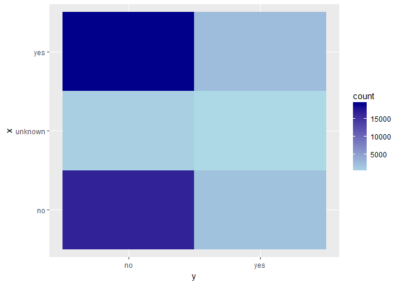

Bank Data Analysis
================

Load libraries and data
-----------------------

``` r
bank <- read.csv("bank-additional-full.csv", sep = ";")
str(bank)
```

    ## 'data.frame':    41188 obs. of  21 variables:
    ##  $ age           : int  56 57 37 40 56 45 59 41 24 25 ...
    ##  $ job           : Factor w/ 12 levels "admin.","blue-collar",..: 4 8 8 1 8 8 1 2 10 8 ...
    ##  $ marital       : Factor w/ 4 levels "divorced","married",..: 2 2 2 2 2 2 2 2 3 3 ...
    ##  $ education     : Factor w/ 8 levels "basic.4y","basic.6y",..: 1 4 4 2 4 3 6 8 6 4 ...
    ##  $ default       : Factor w/ 3 levels "no","unknown",..: 1 2 1 1 1 2 1 2 1 1 ...
    ##  $ housing       : Factor w/ 3 levels "no","unknown",..: 1 1 3 1 1 1 1 1 3 3 ...
    ##  $ loan          : Factor w/ 3 levels "no","unknown",..: 1 1 1 1 3 1 1 1 1 1 ...
    ##  $ contact       : Factor w/ 2 levels "cellular","telephone": 2 2 2 2 2 2 2 2 2 2 ...
    ##  $ month         : Factor w/ 10 levels "apr","aug","dec",..: 7 7 7 7 7 7 7 7 7 7 ...
    ##  $ day_of_week   : Factor w/ 5 levels "fri","mon","thu",..: 2 2 2 2 2 2 2 2 2 2 ...
    ##  $ duration      : int  261 149 226 151 307 198 139 217 380 50 ...
    ##  $ campaign      : int  1 1 1 1 1 1 1 1 1 1 ...
    ##  $ pdays         : int  999 999 999 999 999 999 999 999 999 999 ...
    ##  $ previous      : int  0 0 0 0 0 0 0 0 0 0 ...
    ##  $ poutcome      : Factor w/ 3 levels "failure","nonexistent",..: 2 2 2 2 2 2 2 2 2 2 ...
    ##  $ emp.var.rate  : num  1.1 1.1 1.1 1.1 1.1 1.1 1.1 1.1 1.1 1.1 ...
    ##  $ cons.price.idx: num  94 94 94 94 94 ...
    ##  $ cons.conf.idx : num  -36.4 -36.4 -36.4 -36.4 -36.4 -36.4 -36.4 -36.4 -36.4 -36.4 ...
    ##  $ euribor3m     : num  4.86 4.86 4.86 4.86 4.86 ...
    ##  $ nr.employed   : num  5191 5191 5191 5191 5191 ...
    ##  $ y             : Factor w/ 2 levels "no","yes": 1 1 1 1 1 1 1 1 1 1 ...

``` r
summary(bank)
```

    ##       age                 job            marital     
    ##  Min.   :17.00   admin.     :10422   divorced: 4612  
    ##  1st Qu.:32.00   blue-collar: 9254   married :24928  
    ##  Median :38.00   technician : 6743   single  :11568  
    ##  Mean   :40.02   services   : 3969   unknown :   80  
    ##  3rd Qu.:47.00   management : 2924                   
    ##  Max.   :98.00   retired    : 1720                   
    ##                  (Other)    : 6156                   
    ##                education        default         housing     
    ##  university.degree  :12168   no     :32588   no     :18622  
    ##  high.school        : 9515   unknown: 8597   unknown:  990  
    ##  basic.9y           : 6045   yes    :    3   yes    :21576  
    ##  professional.course: 5243                                  
    ##  basic.4y           : 4176                                  
    ##  basic.6y           : 2292                                  
    ##  (Other)            : 1749                                  
    ##       loan            contact          month       day_of_week
    ##  no     :33950   cellular :26144   may    :13769   fri:7827   
    ##  unknown:  990   telephone:15044   jul    : 7174   mon:8514   
    ##  yes    : 6248                     aug    : 6178   thu:8623   
    ##                                    jun    : 5318   tue:8090   
    ##                                    nov    : 4101   wed:8134   
    ##                                    apr    : 2632              
    ##                                    (Other): 2016              
    ##     duration         campaign          pdays          previous    
    ##  Min.   :   0.0   Min.   : 1.000   Min.   :  0.0   Min.   :0.000  
    ##  1st Qu.: 102.0   1st Qu.: 1.000   1st Qu.:999.0   1st Qu.:0.000  
    ##  Median : 180.0   Median : 2.000   Median :999.0   Median :0.000  
    ##  Mean   : 258.3   Mean   : 2.568   Mean   :962.5   Mean   :0.173  
    ##  3rd Qu.: 319.0   3rd Qu.: 3.000   3rd Qu.:999.0   3rd Qu.:0.000  
    ##  Max.   :4918.0   Max.   :56.000   Max.   :999.0   Max.   :7.000  
    ##                                                                   
    ##         poutcome      emp.var.rate      cons.price.idx  cons.conf.idx  
    ##  failure    : 4252   Min.   :-3.40000   Min.   :92.20   Min.   :-50.8  
    ##  nonexistent:35563   1st Qu.:-1.80000   1st Qu.:93.08   1st Qu.:-42.7  
    ##  success    : 1373   Median : 1.10000   Median :93.75   Median :-41.8  
    ##                      Mean   : 0.08189   Mean   :93.58   Mean   :-40.5  
    ##                      3rd Qu.: 1.40000   3rd Qu.:93.99   3rd Qu.:-36.4  
    ##                      Max.   : 1.40000   Max.   :94.77   Max.   :-26.9  
    ##                                                                        
    ##    euribor3m      nr.employed     y        
    ##  Min.   :0.634   Min.   :4964   no :36548  
    ##  1st Qu.:1.344   1st Qu.:5099   yes: 4640  
    ##  Median :4.857   Median :5191              
    ##  Mean   :3.621   Mean   :5167              
    ##  3rd Qu.:4.961   3rd Qu.:5228              
    ##  Max.   :5.045   Max.   :5228              
    ## 

Exploratory Data Analysis
=========================

Histograms. Univariate Analysis
-------------------------------

#### Age

``` r
hist(bank$age)
```

 seems normal. most people within 30-40 age bracket

#### campaign:number of contacts performed during this campaign and for this client.

``` r
hist(bank$campaign)
```


``` r
prop.table(table(as.factor(bank$campaign)))*100
```

    ## 
    ##            1            2            3            4            5 
    ## 42.832863941 25.662814412 12.967369137  6.436340682  3.882198699 
    ##            6            7            8            9           10 
    ##  2.376905895  1.527143828  0.971156648  0.687093328  0.546275614 
    ##           11           12           13           14           15 
    ##  0.429736817  0.303486452  0.223366029  0.167524522  0.123822473 
    ##           16           17           18           19           20 
    ##  0.123822473  0.140817714  0.080120423  0.063125182  0.072836749 
    ##           21           22           23           24           25 
    ##  0.058269399  0.041274158  0.038846266  0.036418374  0.019423133 
    ##           26           27           28           29           30 
    ##  0.019423133  0.026706808  0.019423133  0.024278916  0.016995241 
    ##           31           32           33           34           35 
    ##  0.016995241  0.009711566  0.009711566  0.007283675  0.012139458 
    ##           37           39           40           41           42 
    ##  0.002427892  0.002427892  0.004855783  0.002427892  0.004855783 
    ##           43           56 
    ##  0.004855783  0.002427892

#### pdays:number of days that passed by after the client was last contacted from a previous campaign (numeric 999 means client was not previously contacted)

``` r
prop.table(table(bank$pdays == 999))*100
```

    ## 
    ##     FALSE      TRUE 
    ##  3.678256 96.321744

``` r
hist(bank$pdays[bank$pdays != 999])
```

 a lot of people(96.3%) were not contacted.

#### previous: number of contacts performed before this campaign and for this client

``` r
hist(bank$previous)
```


``` r
prop.table(table(bank$previous))*100
```

    ## 
    ##            0            1            2            3            4 
    ## 86.343109644 11.073613674  1.830630281  0.524424590  0.169952413 
    ##            5            6            7 
    ##  0.043702049  0.012139458  0.002427892

skewed. Most people were contacted 1 time only.

#### emp.var.rate: employment variation rate - quarterly indicator

``` r
hist(bank$emp.var.rate)
```


``` r
prop.table(table(as.factor(bank$emp.var.rate)))*100
```

    ## 
    ##        -3.4          -3        -2.9        -1.8        -1.7        -1.1 
    ##  2.60027192  0.41759736  4.03758376 22.29775663  1.87676022  1.54171118 
    ##        -0.2        -0.1         1.1         1.4 
    ##  0.02427892  8.94192483 18.84772264 39.41439254

``` r
#ratio of positive and negative rates.
prop.table(table(as.factor(bank$emp.var.rate > 0)))*100 # more than 50% time positive rate is seen.
```

    ## 
    ##    FALSE     TRUE 
    ## 41.73788 58.26212

#### cons.price.idx:consumer price index - monthly indicator

``` r
hist(bank$cons.price.idx)
```


#### cons.conf.idx: consumer confidence index - monthly indicator

``` r
hist(bank$cons.conf.idx)
```


#### euribor3m: euribor 3 month rate - daily indicator

``` r
hist(bank$euribor3m)
```


#### nr.employed: number of employees - quarterly indicator

``` r
hist(bank$nr.employed)
```


Bar plots and Heat Maps.
------------------------

``` r
### heat map function
build_tile_plot <- function(x, y)
{
    dat <- data.frame(x,y)
    x_y <- dat %>% group_by(x,y) %>% summarise(count = n())
    print(ggplot(data = x_y, aes(x = x, y = y, fill = count)) + geom_tile() +
              scale_fill_gradient(low = "lightblue", high = "darkblue") +
              coord_flip()
    )
    
}
```

``` r
### outcome variable
ggplot(data = bank, aes(x = y)) + geom_bar() # highly unbalanced
```


``` r
prop.table(table(bank$y))*100 # only 11.2% say yes.
```

    ## 
    ##       no      yes 
    ## 88.73458 11.26542

``` r
### marital:  marital status
ggplot(data = bank, aes(x = marital)) + geom_bar() # mostly married
```


``` r
build_tile_plot(bank$marital, bank$y)
```


``` r
### education
ggplot(data = bank, aes(x = education)) + geom_bar() # mostly university level graduates
```


``` r
build_tile_plot(bank$education, bank$y)
```


``` r
### default: has credit in default? (categorical: "no","yes","unknown")
ggplot(data = bank, aes(x = default)) + geom_bar() # mostly no
```


``` r
build_tile_plot(bank$default, bank$y)
```


``` r
### housing: has housing loan? (categorical: "no","yes","unknown")
ggplot(data = bank, aes(x = housing)) + geom_bar() # balanced class
```


``` r
build_tile_plot(bank$housing, bank$y)
```



``` r
### loan
ggplot(data = bank, aes(x = loan)) + geom_bar()
```


``` r
build_tile_plot(bank$loan, bank$y)
```


``` r
### contact
ggplot(data = bank, aes(x = contact)) + geom_bar()
```


``` r
build_tile_plot(bank$loan, bank$y)
```


``` r
### month
ggplot(data = bank, aes(x = month)) + geom_bar() # may was high time
```


``` r
build_tile_plot(bank$month, bank$y) # proportionally, may has highest number of NO
```


``` r
### day_of_week
ggplot(data = bank, aes(x = day_of_week)) + geom_bar() # balanced classes
```


``` r
build_tile_plot(bank$day_of_week, bank$y)
```


Boxplots
--------

``` r
### age
ggplot(data = bank, aes(x = y, y = age)) + geom_boxplot()
```


``` r
### campaign
ggplot(data = bank, aes(x = y, y = campaign)) + geom_boxplot() + coord_cartesian(ylim = c(0,10))
```


``` r
### duration: last contact duration, in seconds (numeric)
ggplot(data = bank, aes(x = y , y = duration)) + geom_boxplot()
```


``` r
# people saying yes have more duration of call

### pdays
ggplot(data = bank[bank$pdays != 999, ], aes(x = y, y = pdays)) + geom_boxplot()
```


``` r
### previous
ggplot(data = bank, aes(x = y, y = previous)) + geom_boxplot()
```


``` r
### emp.var.rate
ggplot(data = bank, aes(x = y, y = emp.var.rate)) + geom_boxplot() # people say no when there is high emp.var.rate it seems
```


``` r
### cons.price.idx
ggplot(data = bank, aes(x = y, y = cons.price.idx)) + geom_boxplot()
```


``` r
### cons.conf.idx
ggplot(data = bank, aes(x = y, y = cons.conf.idx)) + geom_boxplot()
```


``` r
### euribor3m
ggplot(data = bank, aes(x = y, y = euribor3m)) + geom_boxplot()
```


``` r
### nr.employed
ggplot(data = bank, aes(x = y, y = nr.employed)) + geom_boxplot() # it seems that people say no when there is high number of people employed
```


Correlation Matrix
------------------

``` r
library(corrplot)

numeric <- sapply(bank, is.numeric)
cordata <- bank[ ,numeric]
cordata <- na.omit(cordata)
cor_matrix <- cor(cordata) # to see correlation table
cor_matrix
```

    ##                          age     duration    campaign       pdays
    ## age             1.0000000000 -0.000865705  0.00459358 -0.03436895
    ## duration       -0.0008657050  1.000000000 -0.07169923 -0.04757702
    ## campaign        0.0045935805 -0.071699226  1.00000000  0.05258357
    ## pdays          -0.0343689512 -0.047577015  0.05258357  1.00000000
    ## previous        0.0243647409  0.020640351 -0.07914147 -0.58751386
    ## emp.var.rate   -0.0003706855 -0.027967884  0.15075381  0.27100417
    ## cons.price.idx  0.0008567150  0.005312268  0.12783591  0.07888911
    ## cons.conf.idx   0.1293716142 -0.008172873 -0.01373310 -0.09134235
    ## euribor3m       0.0107674295 -0.032896656  0.13513251  0.29689911
    ## nr.employed    -0.0177251319 -0.044703223  0.14409489  0.37260474
    ##                   previous  emp.var.rate cons.price.idx cons.conf.idx
    ## age             0.02436474 -0.0003706855    0.000856715   0.129371614
    ## duration        0.02064035 -0.0279678845    0.005312268  -0.008172873
    ## campaign       -0.07914147  0.1507538056    0.127835912  -0.013733099
    ## pdays          -0.58751386  0.2710041743    0.078889109  -0.091342354
    ## previous        1.00000000 -0.4204891094   -0.203129967  -0.050936351
    ## emp.var.rate   -0.42048911  1.0000000000    0.775334171   0.196041268
    ## cons.price.idx -0.20312997  0.7753341708    1.000000000   0.058986182
    ## cons.conf.idx  -0.05093635  0.1960412681    0.058986182   1.000000000
    ## euribor3m      -0.45449365  0.9722446712    0.688230107   0.277686220
    ## nr.employed    -0.50133293  0.9069701013    0.522033977   0.100513432
    ##                  euribor3m nr.employed
    ## age             0.01076743 -0.01772513
    ## duration       -0.03289666 -0.04470322
    ## campaign        0.13513251  0.14409489
    ## pdays           0.29689911  0.37260474
    ## previous       -0.45449365 -0.50133293
    ## emp.var.rate    0.97224467  0.90697010
    ## cons.price.idx  0.68823011  0.52203398
    ## cons.conf.idx   0.27768622  0.10051343
    ## euribor3m       1.00000000  0.94515443
    ## nr.employed     0.94515443  1.00000000

``` r
corrplot(cor_matrix, method = "square", type = "lower")
```


Very high collinearity between following pairs of features: euribor3m and emp.var.rate, nr.employed and emp.var.rate nr.employed and euribor3m
