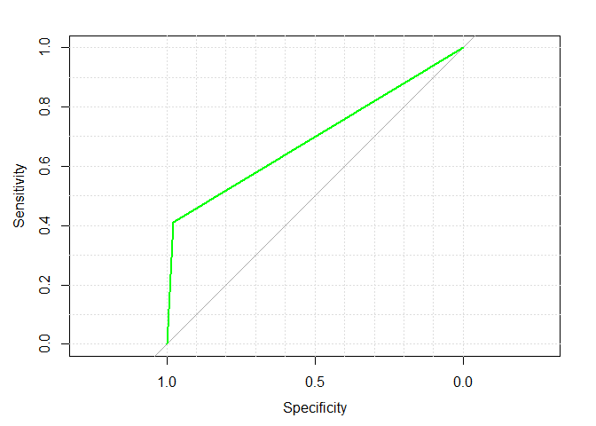

Predictive modelling on Portuguese bank data
================

Load libraries and get input
----------------------------

``` r
bank <- read.csv("bank-additional-full.csv", sep = ";")
```

One Hot Encoding
----------------

Converting categorical variables to numerical vectors.

``` r
y <- bank$y
dummies <- dummyVars(y ~ ., data = bank)
bank <- as.data.frame(predict(dummies, bank))
bank$y <- y
```

Change response variable's value from "yes" and "no" to 1 and 0.
----------------------------------------------------------------

Some algorithms handle only numeric data.

``` r
bank$y <- as.character(bank$y)
bank$y[bank$y == "yes"] <- 1
bank$y[bank$y == "no"] <- 0
bank$y <- as.factor(bank$y)
```

Split data in to train and validation set
-----------------------------------------

``` r
set.seed(123)
indices <- sample(2, nrow(bank), replace = T, prob = c(0.75, 0.25))
train <- bank[indices == 1, ]
cv <- bank[indices == 2, ]

# Check distribution of response variable
prop.table(table(train$y))*100
```

    ## 
    ##        0        1 
    ## 88.73453 11.26547

``` r
prop.table(table(cv$y))*100
```

    ## 
    ##        0        1 
    ## 88.73475 11.26525

DECISION TREE
-------------

``` r
set.seed(123)
tree.model <- rpart(y ~ ., data = train, method = "class", minbucket = 10)
prp(tree.model) 
```


``` r
tree.predict <- predict(tree.model, cv, type = "class")
tree.cm <- confusionMatrix(cv$y, tree.predict)
print(tree.cm$overall[1])
```

    ##  Accuracy 
    ## 0.9128296

``` r
print(tree.cm$byClass[1:2])
```

    ## Sensitivity Specificity 
    ##   0.9377759   0.6480000

RANDOM FOREST
-------------

``` r
set.seed(10)
rf.control = trainControl(method = "cv", number = 3)
rf.grid = expand.grid(mtry = 3)
rf.model <- train(y ~ ., data = train, method = "rf", preProcess = c("center", "scale"),
                  metric = "Accuracy", trControl = rf.control, tuneGrid = rf.grid)

rf.predict <- predict(rf.model, cv)
rf.cm <- confusionMatrix(cv$y, rf.predict)
print(rf.cm$overall[1])
```

    ##  Accuracy 
    ## 0.9088941

``` r
print(rf.cm$byClass[1:2])
```

    ## Sensitivity Specificity 
    ##   0.9143033   0.7758186

### GRADIENT BOOSTED TREES

``` r
bank$y <- as.integer(bank$y)

gbm.model <- gbm(y ~ .,
                 distribution = "multinomial",
                 data = train,
                 n.trees = 1000,
                 interaction.depth = 1,
                 n.minobsinnode = 10,
                 shrinkage = 0.01,
                 train.fraction = 1.0,
                 keep.data = TRUE,
                 verbose = TRUE)
```

``` r
gbm.perf(gbm.model)
```


    ## [1] 904

``` r
gbm.predict <- predict(gbm.model, cv, n.trees = gbm.perf(gbm.model, plot.it = F), type = "response")
```

``` r
# choosing class with highest probability among the two
gbm.predict <- apply(gbm.predict, 1, which.max) - 1
gbm.cm <- confusionMatrix(gbm.predict, cv$y)
print(gbm.cm$overall[1])
```

    ##  Accuracy 
    ## 0.9133215

``` r
print(gbm.cm$byClass[1:2])
```

    ## Sensitivity Specificity 
    ##   0.9769376   0.4122271

ROC curves
----------

``` r
library(ROCR)
```


``` r
library(pROC)
```

``` r
tree.predict <- predict(tree.model, cv)
roc_curve <- roc(cv$y, tree.predict[, 1], plot=TRUE, auc=TRUE, grid=TRUE, col="blue")
```


``` r
rf.predict <- predict(rf.model, cv, type = "prob")
roc_curve <- roc(cv$y, rf.predict[ ,1], plot=TRUE, auc=TRUE, grid=TRUE, col="red")
```


``` r
roc_curve <- roc(cv$y, gbm.predict, plot=TRUE, auc=TRUE, grid=TRUE, col="green")
```



#### Looking at the ROC curves, the best specificity and sensitivity balance is given by random forest.
